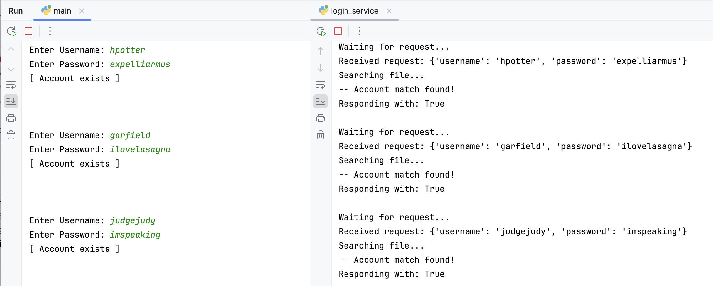
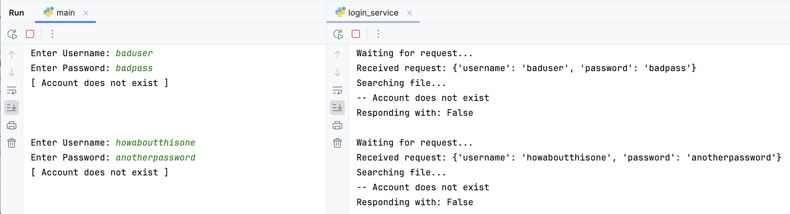
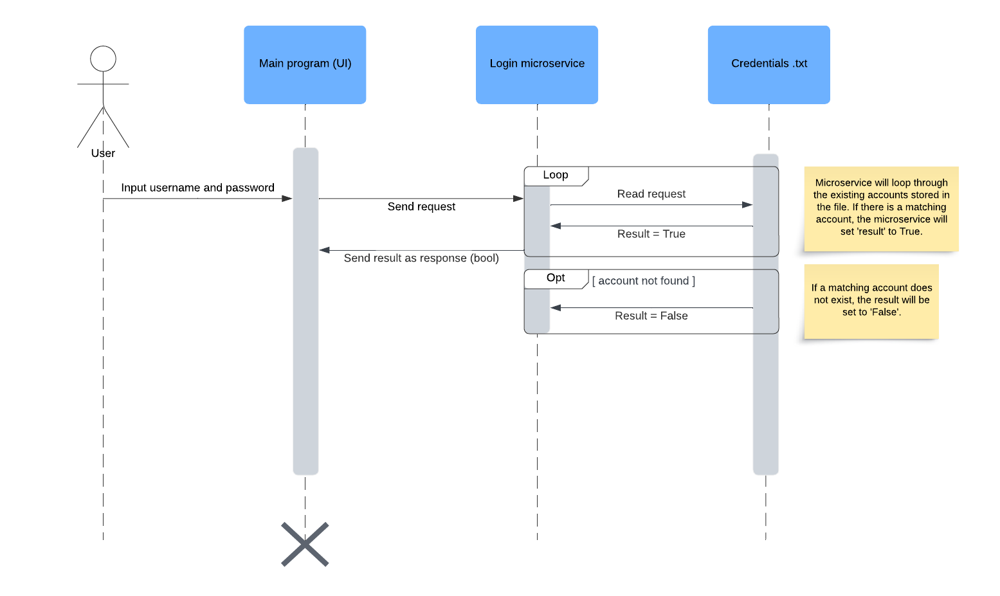

# Microservice A - Login Authentication

## Group Communication Contract
- We will communicate via Teams.
- We will respond to posts within 24 hours.
- We will create and follow deadlines to ensure no one falls behind.
- We will communicate with each other if one of us begins to fall behind.

## How to Request Data
***
To request data, prompt the user for their username and password.

The data will be stored as a dictionary and gets sent to the login server.

## How to Receive Data
***
The login server will respond with a boolean.

If the account exists, the response will be True. Otherwise, the response will be False.

## Example Calls
***
#### Existing Accounts: 

#### Non-Existing Accounts: 

## UML Diagram
***
